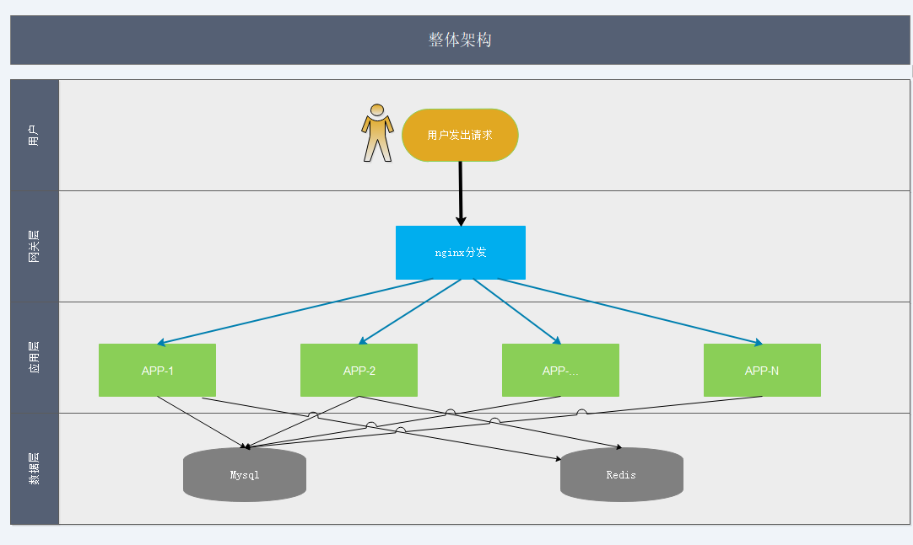

# QA系统服务端

> 此系统主要为了记录在新的人介入到项目组中时会遇到坑，方便检索找方法跳坑，此系统面向内部人员，所以登录一些权限要求会严格一点，顺便把自己的权限框架用起来。
## 整体架构图

## 技术<前后端分离项目，暂时很菜，欢迎拍砖。>
1. springBoot
2. mybatis
3. redis
4. jwt
5. docker
6. mysql
7. nginx

## License

The QaSystem is released under version 2.0 of the Apache License.